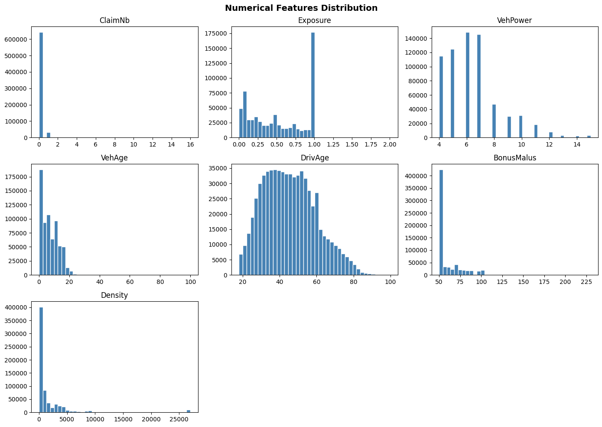

# Motor Insurance Claim Frequency Modeling with GLMs

## Overview

This project explores how Generalized Linear Models (GLMs) can be used to model insurance claim frequency.

The goal is to estimate expected claim frequency per policy while accounting for exposure and risk characteristics. The focus is on understanding the modeling process and interpreting results.

---

## Dataset

The dataset contains motor insurance policy-level data, including:

* **ClaimNb**: Number of claims (target)
* **Exposure**: Policy exposure duration
* **Risk factors**:

  * Driver age (`DrivAge`)
  * Vehicle age (`VehAge`)
  * Vehicle power (`VehPower`)
  * Bonus-malus score (`BonusMalus`)
  * Vehicle brand (`VehBrand`)
  * Fuel type (`VehGas`)
  * Area and Region
  * Population density (`Density`)

---

## Exploratory Data Analysis



Key observations:

* Claim counts are highly skewed with many zero-claim policies
* Exposure varies significantly across policies
* Density is strongly right-skewed
* Bonus-malus shows a clear concentration at lower values

---

## Problem Definition

We model expected claim frequency as:

E[ClaimNb] = Exposure × λ

Using a GLM with log-link:

log(E[ClaimNb]) = log(Exposure) + Xβ

Where `log(Exposure)` is used as an offset.

---

## Modeling Approach

### Poisson GLM

* Baseline model
* Simple and interpretable
* Shows systematic overestimation

### Negative Binomial GLM

* Handles overdispersion
* Slight improvement over Poisson
* Calibration still imperfect

### Two-Stage Model (Final)

To handle the large number of zero claims:

* Stage 1: Logistic regression → probability of having a claim
* Stage 2: Poisson GLM → number of claims given a claim

Final prediction:

Expected Claims = P(Claim > 0) × E[ClaimNb | Claim > 0]

---

## Results

### Calibration by Area (Final Model)

| Area | Actual | Predicted |
| ---- | ------ | --------- |
| A    | 0.0817 | 0.1025    |
| B    | 0.0883 | 0.1102    |
| C    | 0.0945 | 0.1190    |
| D    | 0.1093 | 0.1394    |
| E    | 0.1223 | 0.1573    |
| F    | 0.1391 | 0.1576    |

The two-stage model reduces the overestimation observed in single-stage models.

---

### Decile Analysis

| Decile | Actual | Predicted |
| ------ | ------ | --------- |
| 0      | 0.053  | 0.076     |
| 5      | 0.081  | 0.113     |
| 9      | 0.196  | 0.310     |

* Claim frequency increases consistently across deciles
* Model captures relative risk well

---

## Key Findings

* Bonus-malus is the strongest predictor
* Driver age shows a non-linear effect
* Density is positively associated with risk
* Regional differences are significant
* Two-stage modeling improves calibration

---

## Project Structure

* `glm_model.py` → main script (data loading, modeling, evaluation)
* `claim_hist.png` → EDA visualization
* `freMTPL2freq.csv.zip` → dataset (needs to be extracted)

---

## How to Run

1. Install dependencies:

```bash
pip install -r requirements.txt
```

2. Extract the dataset:

```bash
unzip freMTPL2freq.csv.zip
```

3. Run the model:

```bash
python glm_model.py
```

---

## Notes

This is a learning-oriented project focused on applying GLMs in an insurance context. The emphasis is on understanding modeling choices rather than building a production system.
